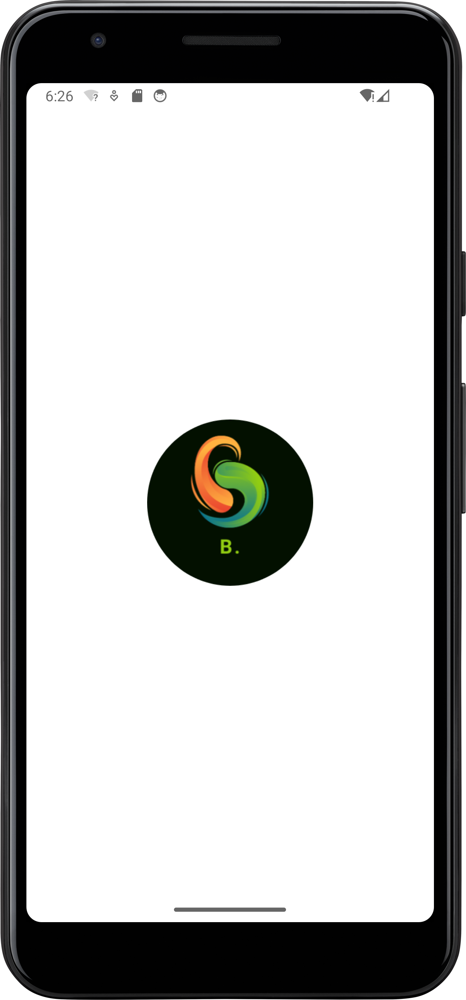
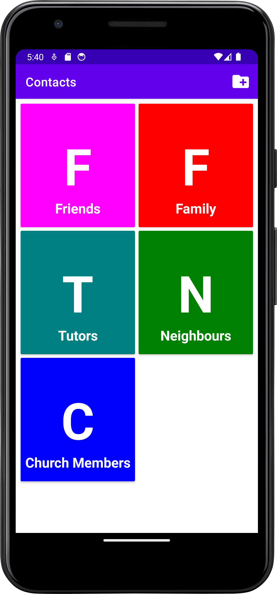
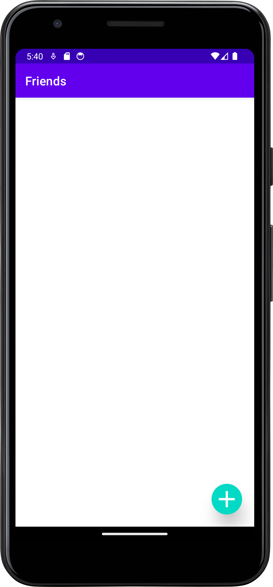
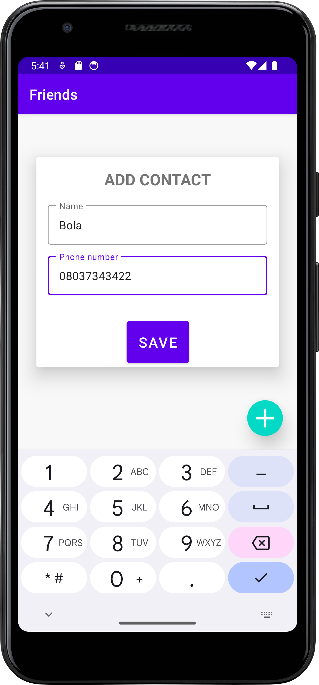
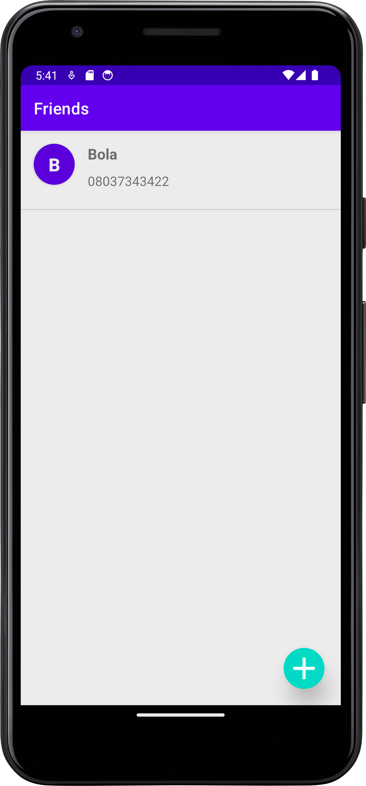
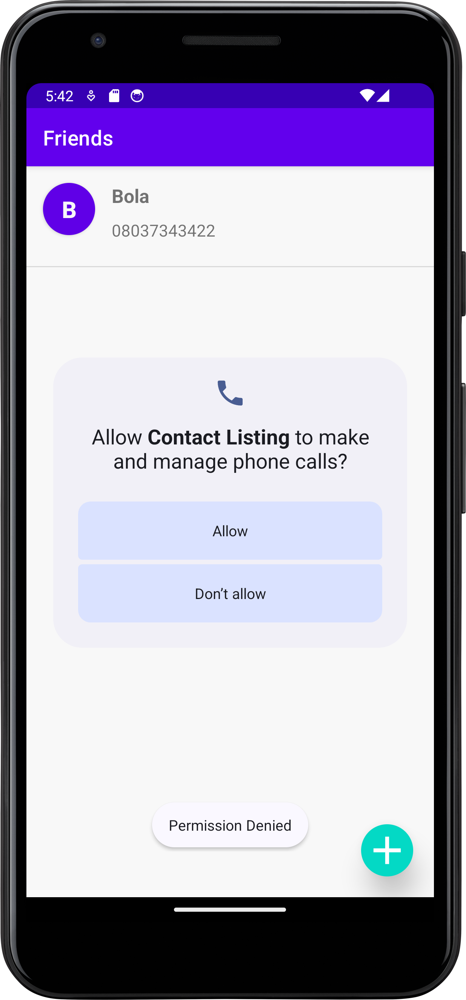

# Contact App
The Contact App is a simple mobile application that allows you to save your contacts by category and make calls directly from the app. This app is built using Kotlin and utilizes RecyclerView with Grid Layout.

## Screenshots of App
### Splash screen

### Home Screen

### Category Screen (Friend)

### Add Contact Alert

### Make Call

# Contact App

The Contact App is a simple and user-friendly mobile application that allows you to save your contacts by category and make calls directly from the app. This app is built using Kotlin and utilizes RecyclerView with Grid Layout. It also uses Room Database to store the contact data locally.

## Features
- Add, edit, and delete contacts
- Assign contacts to different categories (family, friends, work, etc.)
- Make phone calls from the app

## Technologies Used
- Kotlin
- Android Studio
- Room Database
- RecyclerView

I have also edited your image to make it more attractive and eye-catching. Here is the result:

